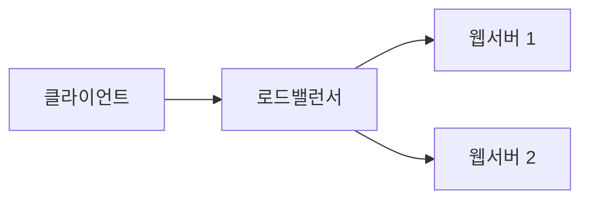

## 들어가며

[1편](/blog/2026-02-05-markdown-basics)·[2편](/blog/2026-02-12-markdown-code-tables-images)에서 다룬 건 어디서든 통하는 표준이었다. 이번 편은 **표준을 넘어서는 확장 영역**이다. 두 가지 갈래로 나뉜다.

1. **GFM (GitHub Flavored Markdown)**: GitHub이 추가한 확장. 노션, 블로그 등 대부분이 따른다.
2. **MDX**: Markdown + JSX. React 컴포넌트를 본문에 직접 임베드.

## Part A. GFM 확장

### 1) 체크박스 / 할 일 목록

````md
- [ ] 할 일
- [x] 끝낸 일
- [ ] 또 다른 할 일
````

이슈, PR, README 진행 현황에 자주 쓴다. CommonMark 표준에는 없지만 거의 모든 시스템이 지원한다.

### 2) 자동 링크 변환

GFM에서는 URL을 그냥 적어도 자동으로 링크가 된다.

````md
https://github.com 처럼 그냥 적어도 클릭 가능한 링크가 된다.
````

이슈/PR 참조도 자동:

````md
#42 같은 형식이 같은 저장소의 이슈 #42로 자동 링크됨.
@username 도 사용자 프로필로 링크.
````

(이건 GitHub 안에서만 동작 — 자체 블로그에선 알아서 처리해야 함.)

### 3) 취소선

````md
~~취소선~~
````

→ ~~취소선~~

(2편 강조 섹션에서도 다뤘지만, 이건 엄밀히는 GFM 확장.)

### 4) 각주 (footnote)

긴 글에서 본문 흐름을 끊지 않고 부연을 달 때.

````md
이 논문[^1]은 RAG의 새로운 평가 방식을 제안한다.

[^1]: arXiv:2605.05253, EnterpriseRAG-Bench (2026)
````

블로그가 remark-gfm 플러그인을 쓰면 동작. 일부 자체 빌드는 안 될 수 있다.

### 5) 표 (1편에서 다뤘지만 GFM 확장)

기본 Markdown에는 표가 없다. 우리가 당연하게 쓰는 `| ... |` 형식은 모두 **GFM 확장**이다. 그래서 일부 노션 임포트 같은 환경에서 표가 깨지는 일이 생긴다.

## Part B. MDX — Markdown + React

[MDX](https://mdxjs.com)는 Markdown 안에 JSX(React 컴포넌트)를 그대로 쓸 수 있게 해준다. 이 블로그도 MDX로 동작한다.

### 1) 기본 — 컴포넌트 임포트와 사용

```mdx
import { Callout } from "@/components/mdx";

# 글 제목

본문에서 컴포넌트를 직접 쓴다:

<Callout type="tip">
이건 React 컴포넌트가 그대로 렌더된 것.
</Callout>
```

이 블로그는 `mdx-components.tsx`에서 전역 컴포넌트 매핑을 해두기 때문에 매번 import하지 않아도 된다.

### 2) 자주 쓰는 커스텀 컴포넌트

이 블로그는 다음을 제공한다 (`docs/components.md` 참조).

```mdx
<Callout type="warning">주의 박스</Callout>

<Paper
  title="Attention Is All You Need"
  authors="Vaswani et al."
  year={2017}
  venue="NeurIPS"
  arxiv="1706.03762"
/>

<Figure
  src="/images/diagram.png"
  alt="설명"
  caption="아키텍처"
  width={800}
  height={450}
/>
```

### 3) Markdown과 JSX 혼용 시 주의점

```mdx
<Callout type="note">
**굵게** 같은 markdown 문법은 컴포넌트 안에서도 동작한다.

다만 JSX 태그 시작 줄과 markdown 사이에 **빈 줄**이 필요하다.
</Callout>
```

빈 줄을 두지 않으면 markdown 파서가 JSX를 일반 텍스트로 처리한다. 가장 흔한 함정.

### 4) 인라인 JSX 표현식

```mdx
오늘은 {new Date().toLocaleDateString("ko-KR")} 입니다.
```

본문 한가운데에 JS 표현식을 박을 수 있다. 강력하지만 너무 자주 쓰면 글이 코드처럼 변한다 — 자제.

## Part C. 그 외 확장 — 거의 표준이 된 것들

### 1) 수식 (KaTeX/MathJax)

블로그 / 노트 시스템 대다수가 LaTeX 수식을 지원한다.

````md
인라인: $E = mc^2$

블록:

$$
\text{Attention}(Q, K, V) = \text{softmax}\left(\frac{QK^T}{\sqrt{d_k}}\right)V
$$
````

→ 인라인: $E = mc^2$

블록:

$$
\text{Attention}(Q, K, V) = \text{softmax}\left(\frac{QK^T}{\sqrt{d_k}}\right)V
$$

frontmatter에 `math: true`로 활성화 (이 블로그 컨벤션).

### 2) Mermaid — 다이어그램

````md

````

코드블록을 다이어그램으로 렌더링. GitHub README, 노션, 일부 블로그가 지원한다. 텍스트로 다이어그램을 버전 관리할 수 있어 강력하다.

### 3) Admonition / Callout

VuePress, Docusaurus, MkDocs 등은 자체 callout 문법을 제공한다.

````md
:::tip 제목
내용
:::

:::warning
주의
:::
````

이 블로그는 React 컴포넌트(`<Callout>`)를 쓰는 방식. 결과는 같다.

### 4) 코드 블록 라인 강조 / diff

````md
```ts {2-3}
function add(a: number, b: number) {
  const result = a + b;  // 강조됨
  return result;          // 강조됨
}
```

```diff
- const a = 1;
+ const a = 2;
```
````

블로그 빌드 설정(`rehype-pretty-code`, `shiki` 등)에 따라 가능.

## 환경별 지원 매트릭스

| 기능 | CommonMark | GFM | MDX | 노션 | Slack |
|------|:----------:|:---:|:---:|:----:|:-----:|
| 기본 문법 | ○ | ○ | ○ | ○ | ○ |
| 표 | × | ○ | ○ | ○ | × |
| 체크박스 | × | ○ | ○ | ○ | × |
| 각주 | × | △ | ○ | × | × |
| 수식 | × | △ | ○ | ○ | × |
| Mermaid | × | ○ | ○ | △ | × |
| React 컴포넌트 | × | × | ○ | × | × |
| 자동 URL 변환 | × | ○ | △ | ○ | ○ |

(△: 일부 환경/플러그인에서만)

<Callout type="tip">
**이식성을 우선시한다면** CommonMark + GFM 범위에서만 쓰는 게 안전하다. 한 곳에서 작성한 글을 노션, GitHub README, 블로그로 모두 옮길 수 있다.<br /><br />
**한 곳(블로그)에 정착할 거라면** MDX 컴포넌트까지 적극 활용. 글의 표현력이 한 단계 올라간다.
</Callout>

## 시리즈를 마치며

3편에 걸쳐 Markdown을 정리했다. 다시 한 줄씩.

- **1편**: 어디서든 통하는 표준 — 헤딩, 강조, 리스트, 링크, 인용
- **2편**: 자주 쓰지만 자주 깨지는 영역 — 코드, 표, 이미지
- **3편**: 표준을 넘어서는 확장 — GFM의 체크박스/각주, MDX의 React 컴포넌트, 수식과 Mermaid

Markdown은 "이정도면 다 안다"고 생각하는 순간 새로운 확장이 추가된다. 글을 어디 올리는지에 따라 작동/안 작동이 달라지니, **타깃 환경의 지원 범위를 먼저 확인**하는 습관이 결국 가장 큰 시간 절약이다.

## 참고 자료

- [CommonMark Spec](https://spec.commonmark.org)
- [GitHub Flavored Markdown Spec](https://github.github.com/gfm/)
- [MDX Documentation](https://mdxjs.com)
- [Mermaid](https://mermaid.js.org)
- [KaTeX 함수 목록](https://katex.org/docs/supported.html)
- [이전 편: 코드, 표, 이미지](/blog/2026-02-12-markdown-code-tables-images)
