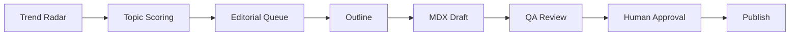

# AI 글쓰기 자동화 Flow

> 목적: AI 트렌드, 신기술 소개, 논문 리뷰, 실무 적용 아이디어를 자동으로 발굴하고 블로그 초안 생성부터 공개 발행까지 연결한다.  
> 원칙: 기본 생성 단계는 `draft: true`로 안전하게 만들고, `ai-blog-auto-publisher`가 검증된 초안을 하루 1편씩 공개 발행한다.

## 0. 산출물 위치

- 아이디어/소스 큐: `docs/ai-writing-inbox.md`
- 편집 일정: `docs/editorial-plan.md`
- 자동 생성 초안: `content/posts/YYYY-MM-DD-slug.mdx` (`draft: true`)
- 글 작성 규칙: `docs/content-guide.md`

## 1. 전체 파이프라인



## 1-1. 보강된 운영 목표

자동화의 목표는 “글 개수 채우기”가 아니라 **매일 1편의 기술적으로 검증 가능한 AI 엔지니어링 글**을 안정적으로 내보내는 것이다. 그래서 파이프라인은 아래 네 가지 품질 게이트를 기본으로 둔다.

| 게이트 | 통과 기준 | 실패 시 동작 |
| --- | --- | --- |
| Source Gate | 논문/arXiv, 공식 블로그, 공식 문서, GitHub repo, 릴리즈 노트 등 primary source가 있다 | 후보는 `skipped` 또는 보류 |
| Substance Gate | 메커니즘·아키텍처·실험·코드/운영 포인트 중 2개 이상을 설명할 수 있다 | 단순 뉴스 후보로 제외 |
| Blog Fit Gate | 성연 블로그 톤: agent/RAG/eval/infra/tool-use 관점으로 해석 가능 | backlog 하단으로 이동 |
| Publish Gate | frontmatter/MDX/typecheck/build/CI/URL 확인까지 가능 | 발행하지 않고 draft 유지 |

콘텐츠 믹스는 주 단위로 맞춘다.

- **논문 리뷰 3~4편/주**: agent, RAG, eval, memory, context, tool-use 중심
- **신기술·프레임워크 소개 2편/주**: GitHub repo, official docs, SDK, MCP/tooling 중심
- **실무 적용/튜토리얼 1~2편/주**: 구현 패턴, 운영 체크리스트, 실패 사례 중심

## 2. 단계별 역할

### 1) Trend Radar — 주제 후보 수집

수집 범위:

- **AI/LLM 관련 논문 중심**: arXiv, OpenReview, Papers with Code, 주요 랩 논문/블로그
  - 우선 주제: agent, RAG, eval, memory, inference, architecture, tool-use, reasoning, alignment, benchmark
- **Agent 관련 프레임워크/시스템**: LangGraph, CrewAI, AutoGen, MCP, agent SDK, eval harness, workflow orchestration, sandbox/tool-use, memory system
- **GitHub repo 소개**: AI/LLM/agent 관련으로 기술적 substance가 있고, 아키텍처·개발 워크플로·실무 적용 포인트를 설명할 수 있는 repo
- 성연 블로그에 맞는 실무형 주제: “기술 원리 + 실제 써먹는 방법 + 내 의견”이 가능한 것

추천 비율:

- 논문: 50~70%
- agent framework/system: 20~30%
- GitHub repo 소개: 10~20%

제외:

- 단순 AI 뉴스/투자/비즈니스 기사
- 기술 깊이 없는 제품 출시 요약
- 원문 링크나 코드/논문 근거가 약한 hype 글감

산출물:

- `docs/ai-writing-inbox.md`에 후보 5~10개 추가
- 각 후보는 아래 필드로 기록

```md
### YYYY-MM-DD — 제목 후보
- type: paper | trend | tech | project-idea
- source: URL 또는 arXiv ID
- why-now: 지금 다룰 이유
- angle: 성연 블로그에서 잡을 관점
- difficulty: low | medium | high
- freshness: 1~5
- practicality: 1~5
- confidence: 1~5
- suggested-category: paper-review | study | tutorial | project
- suggested-tags: [...]
- status: idea | drafting | drafted | skipped
- draft: content/posts/YYYY-MM-DD-slug.mdx  # drafted일 때만
```

### 2) Topic Scoring — 쓸 만한 후보 선별

점수 기준:

| 기준 | 설명 |
| --- | --- |
| Freshness | 최근성, 지금 읽을 이유 |
| Technical Depth | 원리·구현·수식으로 깊게 쓸 수 있는가 |
| Practicality | 개발자가 바로 써먹을 수 있는가 |
| Blog Fit | 기존 블로그 시리즈/취향과 맞는가 |
| Source Quality | 원문/논문/공식 문서가 충분한가 |

기본 선택 규칙:

1. 논문 리뷰는 원문 링크/arXiv가 있어야 한다.
2. 신기술 소개는 공식 문서/릴리즈 노트가 있어야 한다.
3. 단순 뉴스 요약은 제외하고, “기술적으로 무엇이 달라졌나”가 보이는 것만 채택한다.
4. 같은 주제군이 2회 연속 나오지 않게 섞는다.

### 3) Editorial Queue — 편집 계획 반영

- 선별된 후보는 `docs/editorial-plan.md`의 백로그에 `아이디어` 또는 `작성중`으로 추가한다.
- 기존 시리즈와 충돌하면 새 단편보다 시리즈 연속성을 우선한다.
- 단, 최신성이 중요한 논문/릴리즈는 “트렌드 슬롯”으로 끼워 넣는다.

추천 주간 구성:

| 요일 | 주제 타입 |
| --- | --- |
| 월 | AI 트렌드/신기술 소개 |
| 수 | 논문 리뷰 |
| 금 | 실무 적용/튜토리얼 |
| 일 | 회고/프로젝트/생각 정리 |

### 4) Outline — 초안 전 개요 생성

글 타입별 템플릿:

#### 논문 리뷰

1. 한 줄 요약
2. 왜 지금 중요한가
3. 기존 방법의 한계
4. 핵심 아이디어
5. 방법론/아키텍처
6. 실험 결과
7. 실무 적용 포인트
8. 내 의견/한계
9. 참고 자료

#### 신기술 소개

1. 무엇이 나왔나
2. 기존 방식과 차이
3. 핵심 구조/동작 원리
4. 개발자가 바로 확인할 수 있는 예제
5. 어디에 쓰면 좋은가
6. 한계/주의점
7. 다음에 볼 것

#### AI 트렌드 분석

1. 이번 변화의 요약
2. 배경 맥락
3. 기술적 변화
4. 생태계 영향
5. 개발자/팀 관점 액션 아이템
6. 내 해석

### 5) MDX Draft — 블로그 초안 생성

필수 규칙:

- 파일: `content/posts/YYYY-MM-DD-slug.mdx`
- frontmatter에 반드시 `draft: true`
- `summary`는 150자 이내
- 본문 첫 헤딩은 `##`
- `paper-review`면 `<Paper />` 컴포넌트 포함
- MDX 숫자 props는 문자열로 쓴다. 예: `year="2026"`
- 외부 주장에는 원문 링크를 단다.

### 6) QA Review — 자동 검토

체크리스트:

- [ ] frontmatter 필수 필드 존재
- [ ] `draft: true` 유지
- [ ] 제목/요약/본문 관점 일치
- [ ] MDX 특수문자 오류 없음
- [ ] 논문/공식 문서 링크 포함
- [ ] “뉴스 요약”이 아니라 기술적 설명이 있음
- [ ] 성연 블로그 톤: 개발자 대상, 핵심 위주, 실무 관점
- [ ] `npm run typecheck` 통과
- [ ] 가능하면 `npm run build` 확인

## 3. Cron 자동화 구성

현재 권장 구성은 5개다.

| Job | Schedule | 역할 | 공개 발행 여부 |
| --- | --- | --- | --- |
| `ai-blog-queue-refill` | 매일 08:45 KST | `posting-plan`/`editorial-plan`/`ai-writing-inbox` 재고 확인 후 부족하면 자료조사로 큐 보충 | 없음 |
| `ai-blog-trend-radar` | 매주 월 09:10 KST | 최신 주제 수집 + inbox 업데이트 | 없음 |
| `ai-blog-draft-writer` | 화/목/토 09:30 KST | 후보 1개를 MDX 초안으로 생성 | 없음, `draft: true` |
| `ai-blog-auto-publisher` | 매일 10:10 KST | `draft: true` 초안 중 검증 가능한 글 1편을 골라 `draft` 제거, build, commit, push, CI/URL 확인 | 있음, 하루 최대 1편 |
| `ai-blog-draft-review` | 일 20:00 KST | 생성 초안 리뷰 + 발행 후보 보고 | 없음 |

## 4. 운영 현황

2026-06-28 기준:

- `ai-blog-trend-radar`: 최신 AI/agent/paper 후보를 `docs/ai-writing-inbox.md`에 계속 보충한다.
- `ai-blog-draft-writer`: 후보를 골라 `draft: true` MDX 초안을 만든다. 공개 발행은 하지 않는다.
- `ai-blog-auto-publisher`: 10:10 KST 매일 실행. 품질 게이트를 통과한 draft를 하루 최대 1편만 공개 발행한다.
- `ai-blog-draft-review`: 일요일 20:00 KST에 초안 품질과 발행 후보를 검토한다.
- 최근 초안:
  - `content/posts/2026-06-25-plans-dont-persist-context-management-agents.mdx` (`draft: true`)
  - `content/posts/2026-06-27-headroom-context-compression-layer.mdx` (`draft: true`)
- 검증 기준: frontmatter check + `npm run typecheck` + `npm run build` + published post는 GitHub Actions/URL 확인
- 보강 사항: `ai-blog-auto-publisher` prompt에 Source/Substance/Blog Fit/Publish Gate와 실패 시 no-push 원복 규칙을 반영했다.

## 5. 운영 규칙

### 5-1. 상태 전이

```text
idea
  -> drafting        # draft-writer가 선택했지만 아직 파일 생성/검증 중
  -> drafted         # MDX 생성 + inbox draft 경로 기록
  -> 검토            # editorial-plan에서 발행 후보로 승격
  -> published       # auto-publisher가 draft 제거, 검증, push, URL 확인 완료

idea -> skipped      # source 약함, 중복, 기술 substance 부족, 시의성 상실
```

- `ai-blog-draft-writer`는 새 글을 만들기만 한다. 공개 발행은 절대 하지 않는다.
- `ai-blog-auto-publisher`만 `draft: true` 제거 권한을 가진다.
- publisher는 한 번에 한 파일만 발행하고, 실패하면 작업 트리를 원복한 뒤 blocker를 보고한다.

### 5-2. 글 유형별 보강 규칙

| 유형 | 반드시 확인할 것 | 본문에 들어가야 할 것 |
| --- | --- | --- |
| paper-review | arXiv/논문 PDF, 핵심 방법, 결과/한계 | `<Paper />`, mechanism, 실험 숫자, agent/system 설계 해석 |
| tech/framework | 공식 문서, GitHub repo, changelog/release | 설치/사용 흐름, 아키텍처, 언제 쓰고 언제 피할지 |
| trend | primary source 2개 이상, 단순 뉴스가 아닌 기술 변화 | 배경, 기술적 변화, 개발자 액션 아이템 |
| tutorial | 재현 가능한 명령/코드/운영 절차 | 단계별 예시, 실패 모드, 체크리스트 |

### 5-3. 실패/복구 규칙

- `npm run typecheck` 또는 `npm run build` 실패 시 commit/push 금지.
- published 글의 RSS 변경은 유지하고, draft-only 검증으로 생긴 `public/rss.xml` timestamp 변경은 되돌린다.
- GitHub Actions가 실패하면 로그를 읽고 MDX/build 문제를 수정한 뒤 재-push한다. 실패한 상태로 완료 보고하지 않는다.
- unrelated dirty file은 건드리지 않고, 필요 시 selective staging 또는 stash isolation을 사용한다.

### 5-4. 현재 기본 규칙

- 자동 발행은 하루 최대 1편만 수행한다. 여러 초안이 있어도 가장 오래 대기한 검증 가능 초안 1개만 공개한다.
- `ai-blog-auto-publisher`는 공개 side effect를 만든다: `draft: true` 제거 → `npm run typecheck` → `npm run build` → commit/push → GitHub Actions 성공 확인 → 공개 URL 200 확인.
- 트렌드 글은 오래된 자료보다 최신 원문 우선.
- 논문 글은 abstract만 읽고 쓰지 말고, 방법론/실험/한계까지 최소 확인한다.
- 글의 기본 톤은 “개념 설명 + 왜 중요한지 + 실무에서 어떻게 볼지”.
- 생성한 초안은 Slack에 파일명, 주제, 핵심 링크, 다음 액션을 짧게 보고한다.
- `draft: true` 초안 검증을 위해 `npm run build`를 실행하면 `public/rss.xml`이 갱신될 수 있다. draft-only 변경이면 커밋 전 RSS 변경분은 되돌린다.

## 6. 수동 명령으로 쓸 때의 프롬프트

```text
~/ai-blog에서 docs/ai-writing-automation-flow.md와 docs/content-guide.md를 기준으로,
docs/ai-writing-inbox.md의 status: idea 후보 중 하나를 골라
content/posts/YYYY-MM-DD-slug.mdx에 draft: true 초안을 작성해줘.
논문/공식 문서 원문 링크를 확인하고, MDX 빌드 오류가 나지 않게 작성한 뒤 typecheck/build 결과까지 보고해줘.
```
